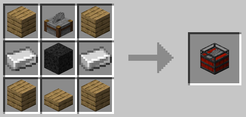

# Blast

**Blast** is a Minecraft Fabric mod that allows you to scratch that itch to blow everything up. It adds multiple throwable bombs and explosive blocks for different situations.

## Wiki

Blast bombs will drop all lootable blocks and do not destroy dropped items; these items however are submitted to the bomb shockwaves (meaning items can go flying if you throw multiple bombs into a single spot).

### Standard Bombs

#### Naval Mines

Naval Mines are bombs that trigger on impact, can destroy blocks and will not sink when thrown underwater.

### Blocks

## Gunpowder block

A heap of gunpowder that can be used as a storage block to your own risks!

- Crafted with 9 gunpowder (can be transformed back into gunpowder).
- Explosion power of 4.
- Fiery explosion.
- Extremely susceptible to instant combustion.

## Stripminer

A directional explosive that simplifies... well, strip-mining.

- Crafting recipe: 

- Can be triggered like a normal TNT.
- Directional explosions!
- Triggering it with an explosion may offset its direction, so be careful!
